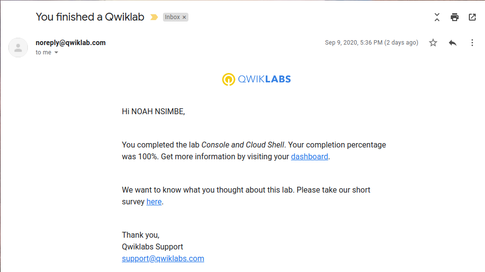
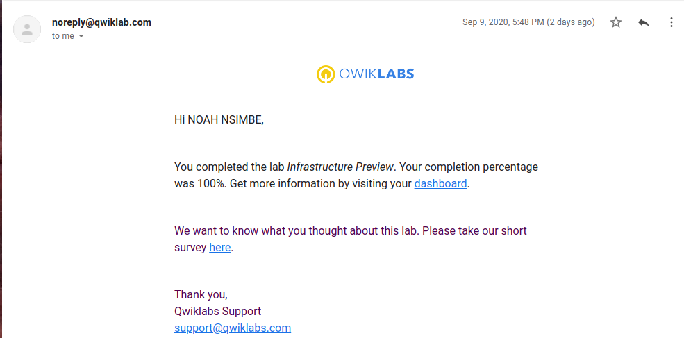
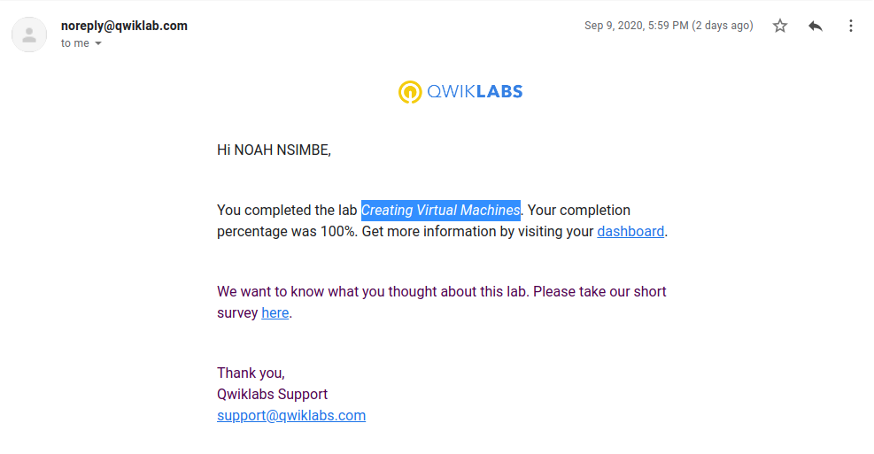
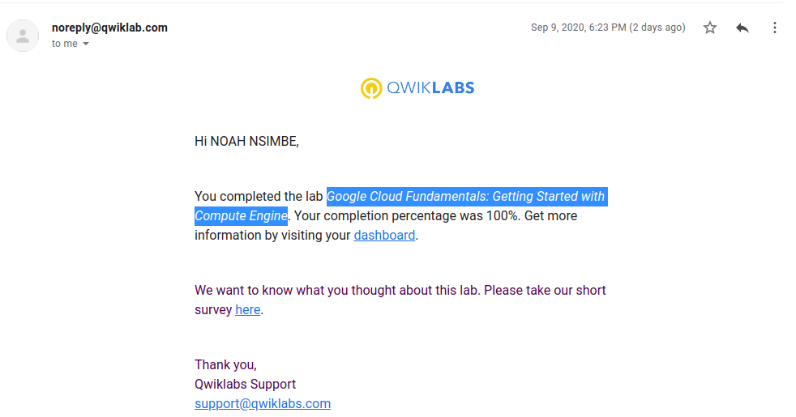
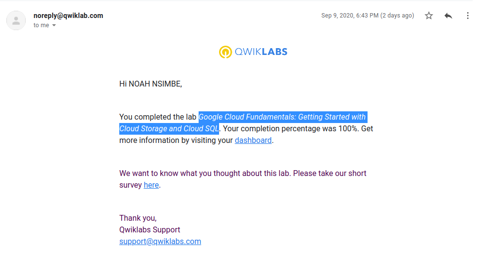
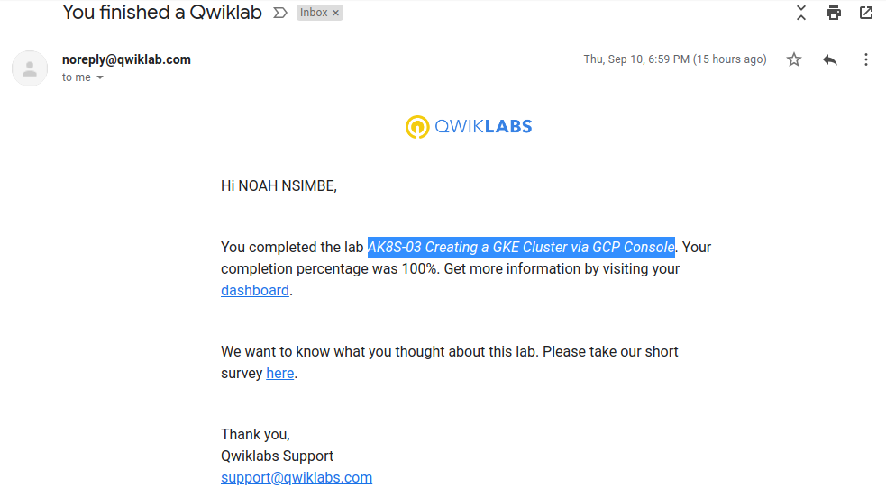
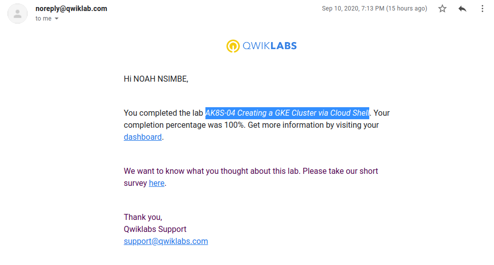
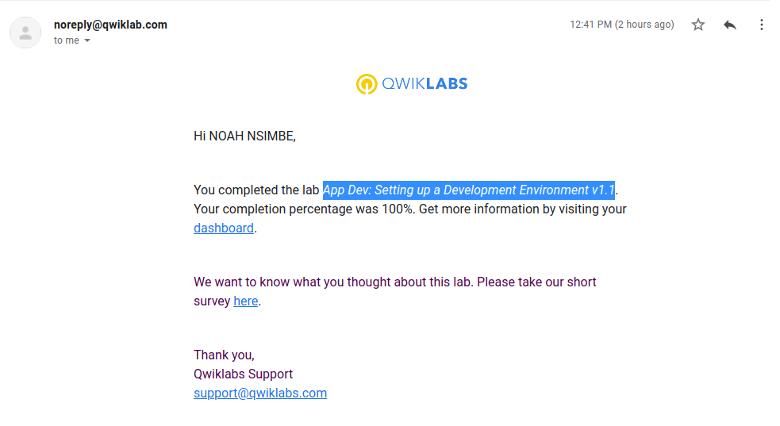

# Course: Essential Google Cloud Infrastructure: Foundation

##  Module: Introduction to Google Cloud

### Console and Cloud Shell

### Infrastructure Preview

## Module: Virtual Machines

### Creating Virtual Machines

# Course: Google Cloud Platform Fundamentals - Core Infrastructure

## Module: Getting Started with Google Cloud Platform

### GCP Fundamentals: Getting Started with Cloud Marketplace

### GCP Fundamentals: Getting Started with Compute Engine

## Module: Storage in the Cloud

### GCP Fundamentals: Getting Started with Cloud Storage and Cloud SQL

## Module: Containers in the Cloud

### GCP Fundamentals: Getting Started with Kubernetes Engine

## Module: Applications in the Cloud

### GCP Fundamentals: Getting Started with App Engine

# Course: Architecting with Google Kubernetes Engine - Foundations

## Module: Kubernetes Architecture

### AK8S-03 Creating a GKE Cluster via GCP Console

# Course: Architecting with Google Kubernetes Engine - Workloads

## Module: Kubernetes Operations

### AK8S-04 Creating a GKE Cluster via Cloud Shell

# Course: Getting Started With Application Development on Google Cloud

## Module: Google Cloud Client Libraries, Google Cloud SDK, and Google Firebase SDK

### App Dev: Setting up a Development Environment v1.1

